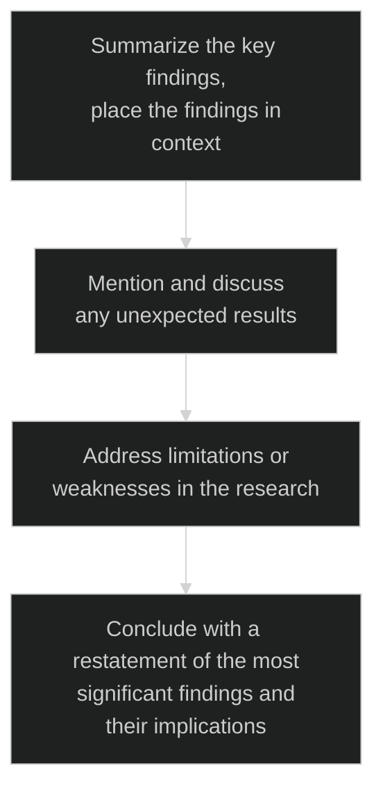
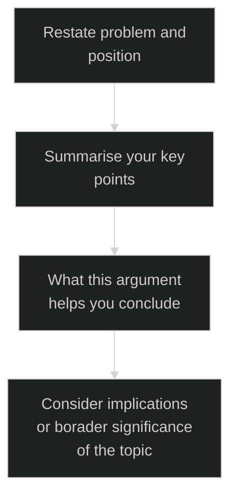

### Research Paper Strategy
<details>
<summary>Module 01 : Research Nutshell</summary>

<details>
<summary>Class 01 : Basic of Research and Research Paper</summary>

**What is Research**

- Research is defined as the creation of new knowledge and/or the use of existing
knowledge in a new and creative way so as to generate new concepts, methodologies and understandings.
- This could include synthesis and analysis of previous research
to the extent that it leads to new and creative outcomes.

**Aim of Research**

- New Knowledge / Information
- Finding Application
- Verifying existing knowledge
- To improve the life style

**What is important feature ?**

- Quality Research
    
    > It is important to maintain quality than quantity. It should be good, verified research.
    > 

**Research Paper**

- A paper that outlines a research challenge, explains why it is important to solve, describes a new solution/answer, and provides some verifications.

**Research paper Example (`Journal Paper`)**

- [Moving Object Detection Using Ultrasonic Radar with Proper Distance, Direction, and Object Shape Analysis](https://www.semanticscholar.org/paper/Moving-Object-Detection-Using-Ultrasonic-Radar-with-Biswas-Abedin/85be687d28b02c914fa6b36dbb03966604a14487)
- Title
- Author names
- Researcher affiliation
- Keywords
- Abstract
- Introduction
- literature review
- Methodology
- Flowchart + Block diagram + Picture
- Result + Result analysis + Visual representation + Graphs
- Discussion
- Comparison with previous work
- Conclusions
- References

**Necessary Tips For Enhancing Skill**

- Finding relevant sources
- Language proficiency
- Organizing information
- Time management

</details>

<details>

<summary>Class 02 : Types of Research Paper and Research Paper Length</summary>

**Types of Research Paper**

- Analytical Research Paper (review paper)
    - A review paper refers to the study and survey of a recently published research paper on a specific topic or subject.
    
    > In analytical writing, an author gathers information from a number of credible and reliable sources and then combines the information to come up with an analysis in the form of an essay.
    >
- Argumentative (Persuasive) Research Paper Definition Paper (problem statement - idea)
    - When a researchers partake in an original study or investigation of a unique topic, the findings of that study are presented as a research paper.
    
    > The argumentative writing goes beyond demonstrating your ideas in a manner that support your thesis statement. An author takes one side of an argument and develops it.
    > 
- Compare and Contrast Paper
- Cause and Effect Paper
- Interpretative Paper
- Experimental Research Paper

**Length of Research Paper**

- Conference Paper `4-6` Pages.
- Journal Paper `12 or more than 20` Pages.

**Conference Paper Example**

- [Hybrid CNN-SVM Model for Brain Tumor Classification utilizing Different Datasets](https://ieeexplore.ieee.org/document/9641201)
- Title
- Author name
- Authors affiliation
- Abstract
- Keywords
- Introduction
- Methodology
- Dataset details
- Steps , flowchart , block diagram
- Research analysis
- Environment
- Mathematical expression
- Comparison
- Conclusions
- Acknowledgement
- References (`14-18`)

**Which Paper is Best**

- It is difficult to say which is best
- Both Research & Review paper are good.
- Focus on where the paper will be submitted.
- Must justify the value of a journal / conference before publishing there.

**Should I Submit My Paper to a Conference or a Journal**

- It depend on research topic
- If it required more analysis —> `Journal Paper`
- Less length analysis —> `Conference Paper`
- Must verify the quality before submission.

</details>

<details>
<summary>Class 03 : Why Research Paper Writing is Important </summary>

**Importance of Research Paper Writing**

- Research sharing, representation of research findings
- Develop critical evaluation ability
- Develop reasoning skills
- Enhance technical writing  proficiency
- Important for research based careers

**When should we need to start writing?**

- After finishing the overall experiment
- After organizing all resources
- After obtaining all the significant outcomes
- Must ensure that your experiment / analysis / process done perfectly

**Important Factors**

- Selection of research topic
- Regularity
- Patience
- Dedication

**Novelty in research**

- What’s new in your research
- What improvement is done
- What significant of that development

</details>

<details>
<summary>Quiz</summary>

1. **It’s not waste of time if**

- [ ]  One is unable to find out the limitation
- [x]  Both (i) & (iii) are correct
- [ ]  One is unable to find the research gap

2. **When should we need to start writing of research paper?**

- [ ]  When all experimental process is finished
- [ ]  When we already finish collecting resource
- [x]  When all experimental process is done and data is obtained

3. **One the important factor of research is:**

- [ ]  Help to build self confidence
- [x]  Quality of research paper
- [ ]  Quantity of research paper

4. **_______ proficiency is helpful for improved research paper writing.**

- [ ]  Writing
- [ ]  Describing problem statement
- [x]  Language

5. **Which paper provides new investigation?**

- [ ]  Survey research paper
- [x]  Research paper or Experimental research paper
- [ ]  Review research paper

</details>

</details>

<details>

<summary>Module 02 : Research Paper Reading Strategy</summary>

<details>

<summary>Class 01 : Why reading research paper is imperative / How to get research papers</summary>

 **Why reading research paper is imperative?**
        
- To get the proper idea
    - Basic idea on that topic
    - methodology
    - working procedure
- To keep updated yourself
    - get idea from old research
    - update information
- To find out the limitations
    - challenging task solution
    - find the limitation on that challenge
    - previous research limitations

**How to get research papers**

| Source | Uses | Link |
| --- | --- | --- |
| Google Scholar | Find the related papers. | https://scholar.google.com/ |
| Sci-Hub | Provide the DOI. | https://sci-hub.se/ |
| ResearchGate | Find the author and paper. | https://www.researchgate.net/ |
| Approach to authors | You can request for that paper. |  |
| ORCID | Open Researcher and Contributor IDentifier . Uniquely identify authors and contributors. | https://orcid.org/ |
| Scopus | Indexing Abstract and citation database. | https://www.scopus.com/home.uri |
| Academia | A for-profit open repository of academic articles free to read by visitors. | https://www.academia.edu/ |

</details>

<details>

<summary>Class 02 : How to read papers in effective way</summary>

**How to read papers in effective way**

- Take your time
- Try to understand
- Be patient
- Take help

**Strategies**

- Read the title
    - does it suit for my research
    - is it related to my research
- Look through the abstract
    - get the idea of that paper
- Go to the Conclusion
    - get the summary of the research
    - result of the end research
    - some researchers write the limitation in this part and what is future plan of his research
- Think about Context and Contribution
    - what problem is solved by this research

**Read more if it pass the strategies**

- Understand the methodology
    - problem can be solved in many way
    - what method is used by the author to solve the problem
    - understand that method
- Read the result and other sections
    - what result that author found
    - how the author analyses
    - how much I need to improve that result
- Finding innovation, hidden failings / assumptions
    - What innovation is found by this research
    - what was author contribution
    - find the limitation
- Notes everything

**Presentation Takeaways**

- Picture
- Graphs
- Flowcharts
- Diagrams

**How many papers we need to read before publishing**

- There is no limit
    - read until get enough knowledge about that topic

**Critically select the most important papers**

- Find the best paper that suit my topic
- gather important information

</details>

<details>

<summary>Quiz</summary>

1. **When we are reading a research paper we need to take enough time to understand it.**

- [ ]  False
- [x]  True

2. **We need to search the appropriate resource for own research and for that we**

- [ ]  We look first at the methodology section of that paper
- [ ]  We look first at the Abstract part of that paper
- [x]  We look first at the title of that paper

3. **Without knowing the topic properly it’s impossible to do great research**

- [x]  True
- [ ]  False

</details>

</details>

<details>
<summary>Module 03 : Research Paper Writing Strategy-Part 01</summary>

<details>
<summary>Class 01 : Writing the first draft / Proper Research Title / Key word</summary>

**How to Write Title**

- Make a draft paper
    - Just in organized way
    - Without any format
- Let’s recap the format
    - Try to know the details of each point
        - Paper title
        - Keywords
        - Abstract
        - Introduction
        - Literature Review / Background Study
        - Methodology
        - Result
        - Discussion (`Journal paper`)
        - Conclusion
        - Reference
        - Acknowledgement

**Paper Title**

- Simple
- Catchy
- Enough details
- Unique
- Concise
- Interesting
- Word limit (mentioned in `journal / Conference` site)
- Author guidelines (mentioned in `journal / Conference` site)
    - **Things to avoid**
        - Unnecessary information
        - Which is not 100% related to your paper
        - Too elaborate
    - **Example**
        - [A Deep Learning Approach for Brain Tumor Classification and Segmentation Using a Multiscale Convolutional Neural Network](https://www.mdpi.com/2227-9032/9/2/153)
        - [Moving Object Detection Using Ultrasonic Radar with Proper Distance, Direction, and Object Shape Analysis](https://e-journal.unair.ac.id/JISEBI/article/view/18840)
        - [Hybrid CNN-SVM Model for Brain Tumor Classification utilizing Different Datasets](https://ieeexplore.ieee.org/document/9641201)

**Keywords**

- Essential words
- Well connected with concepts
    
    > its a word ! Not Sentence

</details>

<details>
<summary>Class 02 : Abstract</summary>

**How to write Abstract**

- Full research paper summary
- Write at the end
- Within `150-300` words
- It’s not a summary of methodology
- Well composed
- Specific & clear
- Must be well written
- Maximum `4 lines`
    - **What it contains**
        - Background Theme
            - What actually I am working on
            - background of that topic
        - Objective / Problem Statement
            - Purpose of this research
            - Aim of the research
            - What problem can be solved
            - Contribution
        - Method
            - which method I used to solved it
            - overview on that method in few lines
        - Result
            - outcome of the research
            - outcome good or bad
            - how much good or bad it is
        - Conclusion
            - Clear understanding
            - What I have analyses
            - finding of the whole research
    - **Need to avoid**
        - start writing randomly
        - missing the problem statement
        - including laboratory procedures
        - irrelevant topic
        - too elaborate
    - **Example**
        
        [Source](https://www.mdpi.com/2227-9032/9/2/153)
        
        ```
        In this paper, we present a fully automatic brain tumor segmentation and classification
        model using a Deep Convolutional Neural Network that includes a multiscale approach. 
        One of the differences of our proposal with respect to previous works is that input 
        images are processed in three spatial scales along different processing pathways. This
        mechanism is inspired in the inherent operation of the Human Visual System. The proposed
        neural model can analyze MRI images containing three types of tumors: meningioma, glioma,
        and pituitary tumor, over sagittal, coronal, and axial views and does not need preprocessing
        of input images to remove skull or vertebral column parts in advance. The performance
        of our method on a publicly available MRI image dataset of 3064 slices from 233 patients
        is compared with previously classical machine learning and deep learning published methods. 
        In the comparison, our method remarkably obtained a tumor classification accuracy of 0.973,
        higher than the other approaches using the same database.
        ```
        
        [Source](https://e-journal.unair.ac.id/JISEBI/article/view/18840)
        
        ```
        Background: In its early development, radar (radio detection and ranging) was primarily 
        used by the navy, the military, and the aviation services, as well as space organizations
        for security and monitoring purposes. Nowadays, the demand of radar is expanding. 
        Research has been conducted to overcome the limitations of radar.
        
        Objective: One of the current limitations to detect moving object. The current paper aims
        to fill the gap in the literature by using a radar system in the identification of moving
        object, capturing the distance, direction, radar pulse duration and object shape simultaneously.
        Velocity or the object’s speed towards or away from the radar was determined by using an
        algorithm to obtain the precision.
        
        Methods: The accuracy of distance measurement and angle is ensured by comparing the real
        values and the values obtained by the radar. The objects under study consist of metal 
        and non-metal. Novelty of this work is the accurate detection of moving objects with 
        suitable algorithms using only one Arduino UNO and one ultrasonic sensor.
        
        Results: The experiment design yielded much better efficiency than previous works. 
        The proposed method predicted the exact speed of the object detected by the radar system.
        The experiment has successfully proven the accuracy of moving object sensor.
        
        Conclusion: Besides proper distance and velocity, a large set of data was taken to 
        find the accuracy of the radar for objects of different shapes. For a cylindrical object,
        the radar provided 100% efficiency in a constant environment when the object was 5 cm away.
        The accuracy decreased to 30% when the distance was 17 cm away. The limitation of this 
        system is that it was unable to detect small object or if the object was very close (1 cm).
        ```
        
    - **When we should write the “Abstract” Section?**
        - write at the end of the research
        - also can be written after methodology

</details>

<details>
<summary>Class 03 : Introduction</summary>

**How to write Introduction**

- It is called foundation of research
- State your research theme
- Be original
- Explain key terms
- Size is important
- Coherence (one by one maintain sequence)
    - **What it contains**
        - What is the topic of research study?
            - Explain my topic
            - What previous researcher did
            - basic idea
        - What is the importance?
            - explain why this is important
        - Past research situation
            - is there any gap previous research
            - limitation
            - why it required to fulfil
            - logical and reference of problem that solve and result difference
        - What is the contribution of this study
            - which challenge I took
            - what I contributed to solve a problem
            - novelty
        - How this paper is organized?
            - how I organized the paper
        - **Overall introduction will contain**
            - Starting the intent of your study
            - Outlining the key characteristics of your study
            - Describing important results
            - Giving a brief overview of the structure of the paper
    - **Example**
        - [Moving Object Detection Using Ultrasonic Radar with Proper Distance, Direction, and Object Shape Analysis](https://e-journal.unair.ac.id/JISEBI/article/view/18840)
        - [A Deep Learning Approach for Brain Tumor Classification and Segmentation Using a Multiscale Convolutional Neural Network](https://www.mdpi.com/2227-9032/9/2/153)
    - **Not to forget!**
        - To include “Problem Statement”
            - First discuss previous paper
            - State which problem we are trying to solve
        - To include “limitations / research gap” in the studies
            - What was previous research limitation
            - how to overcome those

</details>

<details>
<summary>Class 04 : Literature Review</summary>

**How to write literature review**

- It is not same as introduction
- It is not mandatory
- it can be added inside introduction part
- also known as `Background Study`
- It is a survey of scholarly sources (books, journal, articles, theses) related to specific topic or research
    - **It Provides**
        - an overview of current knowledge
        - allowing you to identify relevant theories, methods.
        - gaps in exiting research
    - **In depth**
        - A formal literature review is an evidence-based , in-depth analysis of a subject.
        - Conducting a literature review requires to gather information on a subject or evidence to support a hypothesis.
        - It is essential to read published peer-reviewed original research articles to formulate your literature review.
    - **Need to avoid!!**
        - start writing randomly
        - including experimental procedures
        - irrelevant research study
        - making it too elaborate
        - copy paste
    - **How to organize**
        
        ```mermaid
        %%{init: {'theme': 'dark', "flowchart" : { "curve" : "basis" } } }%%
        graph TD
            A[Finding Resources] --> B[Try to undersand the methodology]
            B -->C[Critical Analysis]
            C -->D[Finding Research Gap]
            D -->E[Compare it with your research]
        ```
        
    - **Literature Review (Conference paper vs Journal paper)**
        
        ```mermaid
        %%{init: {'theme': 'dark', "flowchart" : { "curve" : "basis" } } }%%
        graph LR
            subgraph Journal Paper
            a[Literature review]-->b[Mandatory]
            a[Literature review]-->c[Elaborate and more enrich]
            end
            subgraph Conference paper
            d[Literature review]-->e[Not Mandatory]
            d[Literature review]-->f[Short and more Specific]
            end
        ```
        
    - **Example**
        - [Moving Object Detection Using Ultrasonic Radar with Proper Distance, Direction, and Object Shape Analysis](https://e-journal.unair.ac.id/JISEBI/article/view/18840)
        - [A Deep Learning Approach for Brain Tumor Classification and Segmentation Using a Multiscale Convolutional Neural Network](https://www.mdpi.com/2227-9032/9/2/153)

</details>

<details>
<summary>Class 05 : Methodology</summary>

**How to write Methodology**

- It carries more important
- represent in a way to understand by the reader
- Description each and everything of your research process
- Clear details
- effective representation of framework
- Must mention Quantitative Analysis
    - **It provides**
        - an overview of research procedures
        - allowing to know details
        - exact contribution
- **Methodology steps**
    
    ```mermaid
    %%{init: {'theme': 'dark', "flowchart" : { "curve" : "basis" } } }%%
    graph TD
        A[Describe the process step by step] --> B[Description of collection]
        B -->C[Description of sub-steps]
        C -->D[How you measured]
    ```
    
- **Need to avoid!**
    - Monotonous writing pattern
        - represent in interesting way
    - Including
        - must have necessary things
        - include every method used in research
    - Irrelevant research study
        - avoid irrelevant things
    - Making it too elaborate
        - it should be well organized
        - reader must understand
        - simple way of describing
    - copy paste
- **Important Part of Methodology**
    - Represent it many way
    - Methodology diagram, flowchart
    - Software: [`Draw.io`](http://Draw.io) ,[`Google Slides`](https://docs.google.com/presentation/)
- **Must Mention - Quantitative Analysis**
    - Data Model Parameter Statistical values
        - must include data
        - data processing
        - data category
        - model history
        - model parameter
        - experiment history
- **Example**
    - [Moving Object Detection Using Ultrasonic Radar with Proper Distance, Direction, and Object Shape Analysis](https://e-journal.unair.ac.id/JISEBI/article/view/18840)
    - [A Deep Learning Approach for Brain Tumor Classification and Segmentation Using a Multiscale Convolutional Neural Network](https://www.mdpi.com/2227-9032/9/2/153)

</details>

<details>
<summary>Quiz</summary>

1. **Abstract is nothing but an overall summary of research work.**
- [ ]  True
- [x]  False
2. **The research paper title must be**
- [x]  Complete with (A) and (B)
- [ ]  Simple
- [ ]  Concise
3. **______ must be mentioned in “Literature Review” section.**
- [x]  In-depth analysis
- [ ]  Analysis the result properly
- [ ]  Experimental procedure
4. **Elaborate your title to make perfect one**
- [ ]  True
- [x]  False
5. **Which one is correct?**
- [ ]  Abstract must contain - Small introduction➡️Research aim ➡️ Previous research study
- [ ]  Abstract must contain - Research aim ➡️ Problem Statement ➡️ Research methodology summary
- [x]  Abstract must contain - Small introduction➡️Problem Statement ➡️ Research aim
6. **“Methodology” section must contain:**
- [x]  Description of Data collection
- [ ]  Statement of research limitation
- [ ]  Description of obtained result

</details>

</details>

<details>
<summary>Module 04 : Research Paper Writing Strategy-Part 02</summary>

<details>
<summary>Class 01 : Result</summary>

**How to Write Result**

- Reporting the findings of study
    - what we wanted to do
    - what we get
    - report key finding
- Presenting the result sequentially
    - maintain the sequence
- Organizing the result properly
    - reader must understand easily
- Interpreting the findings of study
    - Interpreting the output we get
    - table , figure details
    - table data
    - what data calculated
- Explaining the experimental setup / environment
    - What we used in experiment
    - experiment environment
    - eg: python ,hardware etc
- Accurate calculation
    - Data calculation
    - equation used
    - result of the calculation
- Clear image captioning, Table arrangement
    - image used details
    - table data details
    - how we get the output
- Interpreting all figures and tables
    - all used table interpreting
    - what this figure used for
    - details etc
- Explaining how the result is improving the challenging task
    - How my result is improve
    - previous result vs my result

**What Should be Written**

- Data presentation in tables, charts, graphs, and other figures
    - reader should understand it
    - represent it in simple way
    - represent it in many ways
- A contextual analysis of this data explaining its meaning in sentence
    - explain the data
- All data that corresponds to the central research question
    - which challenge I worked on
    - which gap I am filling
- All secondary findings (secondary outcomes, subgroup analysis, etc)
    - analyzing the secondary findings

**Not to Forget**

- Presenting more than one result in one figure effectively
    - reduce the number of similar result
- Writing “Result” part more concisely
    - not too much elaborate
    - follow the limitation
- Maintaining “Figure Quality”
    - image quality must be clear
- Converting Table of Figure
    - use `Microsoft Excel` to convert
- How to minimize the number of figure and tables
    - reduce according the limit
    - not too much lengthy

**Example**

- [Moving Object Detection Using Ultrasonic Radar with Proper Distance, Direction, and Object Shape Analysis](https://e-journal.unair.ac.id/JISEBI/article/view/18840)
- [A Deep Learning Approach for Brain Tumor Classification and Segmentation Using a Multiscale Convolutional Neural Network](https://www.mdpi.com/2227-9032/9/2/153)

</details>

<details>
<summary>Class 02 : Discussion</summary>

**How to write Discussion**

- It is optional
- we can add it in result part
- Author describes, analyzes, and interprets their findings.
- explain the significance of those result
- tie everything back to the research question
- how do the result bridge the gap

**What is the purpose of a Discussion Section**

- The discussion reviews the findings and puts them into the context of the overall research.
- It brings together all the sections that came before it and allows a reader to see the connections between each part of the research paper.
- In a discussion section, the author engages in three necessary steps: interpretation, analysis, and explanation.
- An effective discussion section will tell a reader why the research results are important and where they fit in the current literature.

**How to organize “Discussion” Section**



**Things to avoid**

- Don’t rewrite the result section
- Don’t draw conclusions from the findings without support
- Don’t bring up new information
- Don’t analyze only literature section

**Example**

- [Moving Object Detection Using Ultrasonic Radar with Proper Distance, Direction, and Object Shape Analysis](https://e-journal.unair.ac.id/JISEBI/article/view/18840)
- [A Deep Learning Approach for Brain Tumor Classification and Segmentation Using a Multiscale Convolutional Neural Network](https://www.mdpi.com/2227-9032/9/2/153)

</details>

<details>
<summary>Class 03 : Conclusion</summary>

**How to write Conclusion**

- The conclusion of a research paper restates the research problem, summarizes your arguments or findings, and discusses the implications
- You can also include the future work of your research
- Indicate opportunities for future research
- **What is the main purpose of a Conclusion Section**
    - Restating the research problem which is addressed in the paper
        - which problem I am solving
    - Summarizing the overall arguments or findings
- **Abstract and Conclusion are same?**
    - Abstract —> Its a short note that express the contents of the work
    - Conclusion —> Its a statement / decision reached by the researcher based on findings in the research

**Steps to follow**



**Things to avoid!!**

- Too elaborate and bring conflict
- To bring unnecessary topics which are not mentioned in the object of your research
- To forget providing negative information and limitations
- To provide in general report

**Not to forget**

- Mentioning limitations but which actually didn’t hamper the core idea of research study
- Maintain the word limit
- Mention future work

**Example**

- [Moving Object Detection Using Ultrasonic Radar with Proper Distance, Direction, and Object Shape Analysis](https://e-journal.unair.ac.id/JISEBI/article/view/18840)
- [A Deep Learning Approach for Brain Tumor Classification and Segmentation Using a Multiscale Convolutional Neural Network](https://www.mdpi.com/2227-9032/9/2/153)

</details>

<details>
<summary>Class 04 : Reference and proper citation & Acknowledgement</summary>

**How to write Reference**

- It helps to avoid plagiarism
- Unethical claim
- Which ideas are your own
- Which ideas are someone else’s
- It shows your understanding of the topic
- gives supporting evidence for ideas, arguments and opinions
- It indicate where you got the work or information from
- Writing style: `APA style`, `MLA style` & `Chicago style`

**Basic Citation Elements**

- Author(s)
- Title(s)
- Source or venue name (e.g. name of the journal it was published or conference where it was presented)
- Editor(s)
- Volume and edition
- Date or year of publication
- Page numbers
- City and country
- Publisher or university for theses
- URL for online sources
- DOI
- Retrieval date for online sources with dynamic content subjected to change

**Citation Styles**

- APA Style Citation —> APA (`American Psychological Association`)
- MLA Style Citation —> MLA (`Modern Language Association`) based in the U.S.
- Chicago/Turabian Style —> These Style are `interchangeable`
- IEEE Style —> Mainly used for reports in `electronics`, `engineering`, `computer science`, `telecommunications`, & `technology`

**Acknowledgement Section**

- it is important sections for academic research papers
- it appreciates all the contributors of the research paper for their efforts
- Not directly connected but help in research

**Why Acknowledgement Section?**

- it helps to identify the contributors you should try to get everyone who is involved in this research
    - it include the following:
        - Who help Authors/ Classmates
        - Colleagues
        - Institution/ Department
        - Funding Organization/ Donor
        - Professors/ Supervisors
        - Administrative personnel
        - Reviewers
- The information supplied in the acknowledgement section of academic writing should be kept concise.

**Some phrases to start acknowledgement :**

- I’m extremely grateful to …
- I’d like to express my deepest thanks to…
- This project would not have been possible without…
- I cannot begin to express my thanks to...…, Who…
- I would like to extend my deepest gratitude to…
- I would like to pay my special regards to …
- I would like to recognize the invaluable assistance of..…
- I would also like to thank…
- I must also thank…
- I’d also like to express my gratitude to…
- Especially, I would like to thank…
- I am very grateful to…
- I should also appreciate…

**Example**

- [Moving Object Detection Using Ultrasonic Radar with Proper Distance, Direction, and Object Shape Analysis](https://e-journal.unair.ac.id/JISEBI/article/view/18840)
- [A Deep Learning Approach for Brain Tumor Classification and Segmentation Using a Multiscale Convolutional Neural Network](https://www.mdpi.com/2227-9032/9/2/153)

</details>

<details>
<summary>Quiz</summary>

1. **“All data that corresponds to the central research question”-is correct for which section?**
    - [ ]  Discussion
    - [ ]  Methodology
    - [x]  Result
2. **“interpretation, analysis, and explanation”-three are important for which section?**
    - [ ]  Result
    - [x]  Discussion
    - [ ]  Methodology
3. **“Abstract” and “Conclusion” are predominantly homogeneous**
    - [ ]  False
    - [x]  True
4. **“Don’t draw conclusions from the findings without support”-this statement is correct for which section?**
    - [x]  Discussion
    - [ ]  Conclusion
    - [ ]  Result
5. **Which points are correct for “Result” section?**
    - [ ]  Proper interpretation of result
    - [ ]  Statement of improved result
    - [x]  All above are correct
    - [ ]  Experimental values
6. **Conclusion section needs to**
    - [ ]  Showing the contrast between the previous and proposed result
    - [ ]  State the previous results
    - [x]  Summarize all arguments
7. **References are not only important for listing authentic sources but also**
    - [ ]  It can provide extra information to readers
    - [ ]  It can enhance your acceptance rate of research paper
    - [x]  Both (A) and (B) are correct

</details>

</details>

<details>
<summary>Module 05 : Research ethics, Journal conference selection and Modern Research paper writing tools</summary>

<details>
<summary>Class 01 : Research Ethics</summary>

**What does it means**

- Ethics —> Ethics are the set of rules that govern our expectations of our own and others’ behavior

**Research Ethics**

- Research ethics are the set of ethical guidelines that guides us on how scientific research should be conducted and disseminated.
    - follow the guideline of scientific research
- Research ethics govern the standards of conduct for scientific researchers. It is the guideline for responsibly conducting the research.
    - follow the world wide research guideline
- Research that implicates human subjects or contributors rears distinctive and multifaceted ethical, legitimate, communal and administrative concerns.
    - maintain the privacy of collected data, info
    - verify the collected data is real
    - maintain all the issues
- Research ethics is unambiguously concerned in the examination of ethical issues that are upraised when individuals are involved as participants n the study.
    - involvement of human privacy is first
- Research ethics committee/ `Institutional Review Board` (IRB) reviews whether the research is ethical enough or not to protect the rights, dignity and welfare of the respondents.
    - collected data is correct, quality of data is good then it is ethical

**Research Objective**

- The first and comprehensive objective —> to guard/protect human participants, their dignity, rights and welfare .
- The second objective —> to make sure that research is directed in a manner that assists welfares of persons, groups and/or civilization as a whole.
- The third objective —> to inspect particular research events and schemes for their ethical reliability, considering issues such as the controlling risk, protection of privacy and the progression of informed consent.

**Ethical Principles of Research**

- Honesty (**সততা**)
- Responsibility (**দায়িত্ব**)
- Privacy (**গোপনীয়তা**)
- Confidentiality (**বিশ্বাসপ্রবণতা**)
- Autonomy (**ব্যক্তিস্বাধীনতা**)
- Beneficence (**উপকারিতা**)
- Non-maleficence (**অ-দুর্বৃত্ত - ক্ষতি না করা**)
- Competence (**কর্মদক্ষতা**)
- Integrity (**সততা**)
- Justice (**ন্যায়পরতা**)
- Dignity (**মর্যাদা**)

**Research Ethics For Authors**

- Research ethics are moral principles that guide researchers to conduct and report research without deception or intention to harm the participants of the study or members of the society as a whole, whether knowingly or unknowingly.

**Some Ethics For Authors**

- Authors wishing to publish their papers in journals/conference must abide to the following:
    - Accurately present their research findings
    - Including an objective discussion of the significance of findings.
    - All and only those who qualify for authorship should be included as authors, and their contribution given in the manuscript.
    - Any facts that might be perceived as a possible conflict of interest of the author(s) must be disclosed in the paper prior to submission.
    - Data and methods used in the research need to be presented in sufficient detail in the paper so that other researchers can replicate the work. Raw data must be made publicly available unless there is a compelling reason otherwise (e.g., patient confidentiality).
    - Simultaneous submission of manuscripts to more than one journal is not permitted.
    - Original research results must be novel and not, including being previously published in another language.
    - For any content previously published (including quotations, figures or tables), any necessary permission to publish must be obtained from the copyright holder.
    - Errors and inaccuracies found after publication must be promptly communicated to the Editorial Office.
    - Authors must not use the words, figures, or ideas of others without attribution. All sources must be cited at the point they are used, and reuse of wording must be limited and be attributed or quoted in the text.
    - Authors must declare all potential interests in a `Conflicts of interest` section, which should explain why the interest may be a conflict.
    - Research misconduct means making up or falsifying data, manipulating data analyses, or
    misrepresenting results in research reports. It's a form of academic fraud.

</details>

<details>

<summary>Class 02 : Journal and conference selection</summary>

**For Conference Paper**

- First, find a conference that is looking for submissions.
- Search on Google
- Utilizing contacts and connections you might have within any professional organizations
- Social media sources (Group , Pages)
- Publisher quality, indexing
- Does it match my field
- Track down running , upcoming conferences

**For Journal Paper**

- Find journal based on scope and ranking

**Top Tips For Selection**

- Make sure your paper fits within the scope of the journal/ of conference
- Assess the credentials of the journal or publisher
- Browse the content they publish for quality and relevance to your field
- Check the quality of their website
- Check what tools and services they offer to authors
- Submit your research to one journal only, but check if they offer transfers to other journals
- Follow the instructions for authors carefully

**Two main factors to consider when choosing a journal**

- your paper fits within the journal’s scope, and the reputation of the journal itself.
    1. The reputation of the journal. A journal's impact factor is only one measure of its reputation, but not always the most important. You need to consider the prestige of the authors that publish in the journal, and the size of the journal's readership.
    2. You have to chose the journal you think is the best fit for your study and your goals and standard for your manuscript.
- You must observe the registration fee

**More things to aware of**

- Quality Criteria = Impact factor
- Be aware  of FAKE journals !!!
- Only One impact factor is given by “Thomson Reuters”
- Master Journal List of Thomson Reuters - get impact factors. Which is real and shows the quality criteria

**Types and Quality**

- Journal with 30-40 H-index is good enough.
- H-index actually means how much citation that journal received.
- Journals are divided into 4 quarters: Q1, Q2, Q3, Q4.
- Q1 represent first 25% of journals.
- Q2 represent second 25% of journals.
- Q3 represent third 25% of journals.
- Q4 represent rest 25% of journals.
- Q1 Journals indicate the top 25% journal.
- Q1 and Q2 are really good journals.
- When a journal is listed in “Master Journal List”, it means that has high level of editorial record

**Quality Measurement Sites**

- [Scimago](https://www.scimagojr.com/)
- [Master Journal List](https://mjl.clarivate.com/home)
- [Norwegian Register](https://kanalregister.hkdir.no/publiseringskanaler/Forside.action?request_locale=en)
- [ABCD List](https://abdc.edu.au/research/abdc-journal-quality-list/)
- [ABS Ranking](https://charteredabs.org/academic-journal-guide-2021/)

**For more details**

- [Core](http://portal.core.edu.au/jnl-ranks/) (`Conference paper` -`DISCONTINUED FROM MARCH 2022`)
- [Scopus Preview](https://www.scopus.com/home.uri)
- [Google Scholar](https://scholar.google.com/)

**Not to forget**

- DOI is important

</details>

<details>
<summary>Class 03 : Proofread</summary>

**What is Proofreading?**

- It means examining your text carefully to find and correct typographical errors and mistakes in grammar, style, and spelling.
- Checks work to identify all errors in spelling, punctuation and grammar. It also picks up errors in spelling, punctuation and grammar.
- It also picks up instances of inconsistent terminology, formatting and referencing.
- Proofreading tends to result in minor, aesthetic adjustments to text rather than big changes.

**Proofreading vs Editing**

| Proofreading | Editing |
| --- | --- |
| If it is science  | It is an art |
| focus on error fixing | improve the quality of writing  |
| it uses less creativity | it uses more creativity |
| less changes | extensive changes |

**Basic of Editing**

- If proofreading is a science, editing is an art. Editing is the process of improving the overall quality of writing to make an essay the best it can possibly be. It uses much more creativity and often considers the feelings of the work's audience. As such,
- Editing can cause extensive changes to text, bringing up questions such as:
    - Have you chosen the most appropriate words to convey your meaning effectively?
    - Have you used the passive voice?
    - Is the tone right for the audience?
    - Are there unnecessary words or overlong sentences?
    - Can the structure of the essay be changed to?
- Editing is all about making sure the meaning and ideas in a piece of work are conveyed in the best possible way, for the audience.

**What is the main purpose of Proofreading**

- Writing is the most effective way of communicating your research ideas and results. The quality of the research paper decreases if it is filled with spelling, punctuation, and grammatical errors. These errors undermine the credibility of your research work.
- Proofreading is important to ensure that there is not any --> Grammatical error, Capitalization error, Numbering error. Spelling error
- Good research papers (not only well written but also well edited and formatted) tend to reflect an individual’s thinking through their writing to the readers of the paper.

**Top items for proofreading**

- Basic Spelling and Grammar
- Proper Nouns
- Verb Tenses
- Sentence Structure
- Formatting
- Consistency
- Idioms
- Overall Flow

**Not to forget**

- Grammarly Premium Subscription
- Native English Speaker - for proofreading

</details>

<details>
<summary>Class 04 : Templating (modern and conventional)</summary>

**Template**

- The formatting guidelines for a research paper differ by style guide.
- Standard size, font, margin, spacing, alignment of text and others are different from one template to another. But it’s an important issue.
- The purpose of a conference template is to provide a consistent format for papers appearing in the conference proceedings.

**Conventional way**

- Using Microsoft Word : for example `references tab`

**Latest way**

- [LaTex](https://www.latex-project.org/) - Great tool but difficult for non-coder
- [Open Office](https://www.openoffice.org/)
- [Libre Office](https://www.libreoffice.org/)
- [Scrivener](https://www.literatureandlatte.com/scrivener/overview)
- [Google Docs](https://docs.google.com/document/u/0/)
- [Drop Box Paper](https://www.dropbox.com/paper/start)

**What is LaTex**

- Latex is a document preparation system and LaTeX is a software system.
- LaTeX is a free software package created in 1985 by the American computer scientist.
- LaTeX was created to make it easier to produce general purpose books and articles within TeX.
- LaTeX is available as free software. You don't have to pay for using LaTex, i.e., there are no license fees, etc.
- LaTeX is a programming language in a fashion similar to C. In particular, LaTeX code must be compiled to produce a document.
- It's difficult or easy? --> could be difficult for non-coder
- LaTeX gives the user extremely good control over the formatting of documents.
- LaTeX can create scientific documents that look professional and accurately reflect the precise equations and other graphics necessary to express the researcher's work.
- [Overleaf](https://www.overleaf.com/)
    - It is a collaborative cloud-based LaTeX editor used for writing, editing and publishing scientific documents.
    - It partners with a wide range of scientific publishers to provide official journal LaTeX templates, and direct submission links.

**Example**

- Search for `ieee paper template` on [google](https://www.ieee.org/conferences/publishing/templates.html)

</details>

<details>
<summary>Class 05 : Latex detail</summary>

**How to start**

- [LaTeX command](https://www.bu.edu/math/files/2013/08/LongTeX1.pdf)
- Open and Overleaf account
- Latex template collecting
- Uploading the file
- Start to work

</details>

<details>
<summary>Class 06 : Different research paper writing modern tools</summary>

**Research article writing tools**

- Help organizing
- Help to track the citation
- Proper graphical representation
- Improving writing ability

**What should we use research writing tools?**

- Academic writing can be a daunting and time-consuming process, but with the help of the right tools you can make writing your paper much easier.
- Papers and reports can take hours or days to complete and require intense dedication to perfect.
- Smarter way
- Bring perfection in writing

**Purpose of use**

- Writing and editing a draft
- Rewording / Paraphrasing
- Organizing the manuscript
- Referencing

**Research Writing Tools (various tools are used for different purpose)**

- [Todoist](https://todoist.com/) is a task management app that can help you stay organized during the writing process. Todoist can be used for planning, scheduling, and building the outline for your personal, work, and academic tasks.
- [Grammarly](https://www.grammarly.com/) is a typing assistant that uses artificial intelligence to identify any errors in spelling, grammar, and punctuation, then suggests an appropriate replacement.
The basic function of Grammarly is free, which helps identify most spelling and grammar errors, but for a more robust check on everything you write, a paid upgraded premium version is available.
- [Ref-n-Write](https://www.ref-n-write.com/) is a tool with an impressive library of phrases used in academic writing. Using artificial intelligence technology, the tool provides details on choosing the right academic phrase, cross-referencing previous work, suggesting new ideas, and more. Non-native English speakers may find this tool helpful to paraphrase their text and improve their English writing skills through practice.
- [QuillBot](https://quillbot.com/) is the best paraphrasing tool because it has a
built-in Al feature that understands your content
and paraphrases it while keeping the context
intact.
    - QuillBot's Paraphraser helps you write better, faster, and smarter.
    - QuillBot is an extremely useful & powerful paraphrasing tool we have ever used.
    - QuillBot's Paraphraser is fast, free, and easy to use, which makes it the best paraphrasing tool of the market.

**Grammar Checkers and Sentence Correction Tools**

- [MS Word Spelling & Grammar checker](https://www.microsoft.com/en-ww/microsoft-365/word)
- [ProWritingAid](https://prowritingaid.com/)
- [CorrectEnglish](https://correctenglish.com/)
- [StyleWriter](https://www.stylewriter-usa.com/)
- [WhiteSmoke](https://www.whitesmoke.com/)
- [Ginger Software](https://www.gingersoftware.com/)
- [Online Grammar checking sites](https://www.google.com/search?q=Online+Grammar+checking+sites)

**Statistical Analysis Tools**

- [Microsoft Excel](https://www.microsoft.com/en-us/microsoft-365/excel)
- [Matlab (The Mathworks)](https://www.mathworks.com/)
- [SPSS (Statistical Package for the Social Sciences)](https://www.ibm.com/products/spss-statistics)
- [Minitab](https://www.minitab.com/en-us/support/downloads/)
- [R or Rstudio](https://www.r-project.org/)
- [SAS (Statistical Analysis Software)](https://www.sas.com/en_us/software/stat.html)
- [GraphPad Prism](https://www.graphpad.com/features)

**Reference Management Tool**

- [Zotero](https://www.zotero.org/) is a free and open-source reference management software to manage bibliographic data and related research materials.
    - Zotero is a free, easy-to-use tool to help you collect, organize, annotate, cite, and share research.
    - If your research content is diverse, Zotero is the easiest method to gather citation records for non-PDF content.
- [Mendeley](https://www.mendeley.com/) is a software company based in London, UK, which provides products and services for academic researchers. It is most known for its reference manager
which is used to manage and share research papers and generate bibliographies for scholarly articles.
    - Mendeley is a free reference manager that can help you store, organize, note, share and cite references and research data.

**More Tools:**

- [EndNote](https://endnote.com/)
- [RefWorks](https://www.refworks.com/)
- [Citavi](https://citavi.com/)
- [PaperPile](https://paperpile.com/)
- [JabRef](https://www.jabref.org/)
- [Papers](https://www.papersapp.com/)
- [Docear](https://docear.org/)

</details>

<details>
<summary>Quiz</summary>

1. **“Research ethics are the set of ethical guidelines that guide us on how scientific research should be conducted and disseminated.”- which states research ethics perfectly.**
    - [x]  True
    - [ ]  False
2. **Overleaf is used to-**
    - [ ]  Precise the paper
    - [x]  Access Latex
    - [ ]  Know the impact factor
3. **How you will define impact factor**
    - [ ]  Impact factor = Popularity of that journal
    - [ ]  Impact factor = Published paper number
    - [x]  Impact factor = Quality Criteria
4. **“Though Latex language is similar to C but it is not used that much because it is costly”- the statement is -**
    - [x]  False
    - [ ]  True
5. **Research ethics permit us to submit the same research work into various conference or journal- this statement is:**
    - [ ]  False
    - [x]  True
        
        > it is false but system didn’t accept it as `false`
        > 
6. **Which is necessary before submission:**
    - [ ]  Check the authenticity of conference/journal
    - [x]  Both (A) and (B) are correct
    - [ ]  Check the tracklist

</details>

</details>

<details>
<summary>Module 06 : Maintaining some strategies before submission of a Research Paper</summary>

<details>
<summary>Class 01 : Final editing and Checking</summary>

**Why needed**

- To revise and finalize the research paper
    - While transferring from draft to template
- To avoid mistakes!!
    - Grammatical mistake
    - Sentence organization
    - Spelling mistake
    - Unnecessary complex word (use simple word to explain)
    - Punctuation, structure etc
- To check the format
    - Check template format
- To observe the number, analysis, graph, fig, table, reference.
- To check the title, author name, abstract, conclusion again.

**Grammarly and Plagiarism checking**

- Plagiarism is presenting someone else's work or ideas as your own, with or without their consent, by incorporating it into your work without full.
- Plagiarism is considered a violation of academic integrity such as truth and knowledge through intellectual and personal honesty in learning, teaching,
research.
- To detect the duplicate content
- [Grammarly](https://www.grammarly.com/)
- [Turnitin](https://www.turnitin.com/)

</details>

<details>
<summary>Class 02 : Primary review from professional person</summary>

**Why final edit and checking**

- To make meaningful research paper
- To find out the faults
- To improve the research representation
- To find an accurate conclusions
- To find some amazing flaws so that that can be improved in future

**Who can be that person?**

- Professors
- Supervisor
- Peers
- and others (experienced someone)

</details>

<details>
<summary>Class 03 : Submission process</summary>

**Submission sites**

- [MDPI Journal](https://www.mdpi.com/)
- [Elsevier](https://www.elsevier.com/)
- [IEEE Access](https://ieeeaccess.ieee.org/)
- [ICCIT Conference](https://iccit-conference.org/)

</details>

<details>
<summary>Quiz</summary>

1. **Before submission we need to check**
    - [ ]  Graph, figure, table
    - [x]  Author list and (A) and (B)
    - [ ]  Format
2. **Rajoshree completed her research paper and plagiarism while she observed that her similarity percentage is 59%.**
    - [ ]  It’s a good one which indicates that this paper has more than 50% quality.
    - [ ]  It’s not a good one which indicates that this paper has 59 references.
    - [x]  It’s not a good one which indicates that this paper has more than 50% similarity with existing sources.
3. **“To make your research paper meaningful, you can review your paper from a person how is highly professional in this matter” - the statement is**
    - [x]  True
    - [ ]  False

</details>

</details>

<details>
<summary>Module 07 : Practical example of research paper and importance in real life</summary>

<details>
<summary>Class 01 : A practical example</summary>

**Observing a research paper**

- Paper : [Hybrid CNN-SVM Model for Brain Tumor Classification utilizing Different Datasets](https://ieeexplore.ieee.org/document/9641201)

</details>

<details>
<summary>Class 02 : Research Paper writing impact on practical life Acknowledgement</summary>

**What’s The Final Outcome**

- If paper accepted—> Good
- If rejected —> follow reviewer note, changes —> resubmit
- Helpful for writing thesis
- Research based career
- Helpful for higher study

</details>

</details>